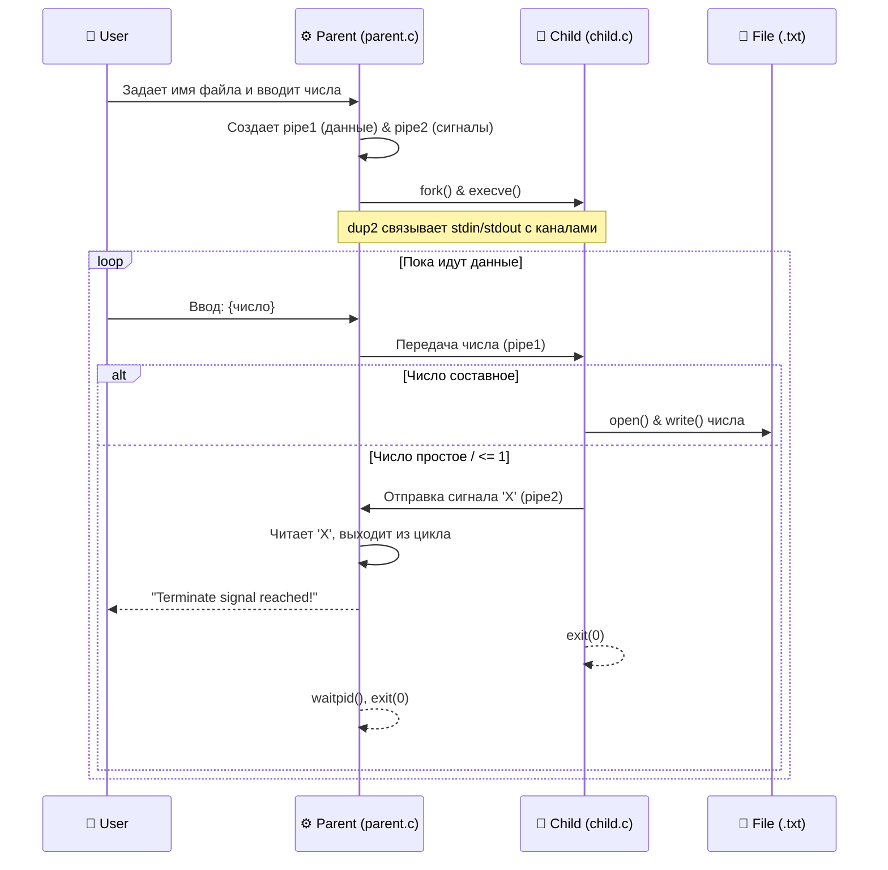

<div align="center">

<!-- Красивая анимированная шапка -->


<!-- Анимированный набирающийся текст -->
<a href="https://git.io/typing-svg">
  
</a>

<!-- Бейджи стека -->
<p align="center">
  
  
  
  
</p>

</div>

---

## 💡 О проекте

Данный репозиторий содержит исходный код лабораторной работы по курсу **«Операционные системы»**. Проект наглядно демонстрирует организацию клиент-серверного взаимодействия между родственными процессами в POSIX-системах.

**Ключевые концепции под капотом:**
* 🔗 Неименованные каналы (`pipe`)
* 🔄 Подмена стандартных потоков ввода-вывода (`dup2`)
* 🧬 Порождение процессов (`fork`) и замещение их образа (`execve`)

---

## 🎯 Вариант 5: Постановка задачи

> **Сценарий работы:**
> Программа принимает от пользователя поток чисел через стандартный ввод. Родительский процесс транслирует эти данные дочернему. Дочерний процесс, в свою очередь, выступает в роли "математического фильтра".

🛠 **Логика обработки чисел дочерним процессом:**
1. 🧮 **Составные числа:** Считаются валидными данными и записываются в целевой текстовый файл.
2. 🛑 **Простые числа, отрицательные, `0` и `1`:** Действуют как **сигнал завершения (kill-switch)**. 
   При их обнаружении дочерний процесс отправляет родителю ответный сигнал, и оба процесса грациозно завершают свою работу.

*Примечание: Целевой файл создается автоматически. Завершение ввода также обрабатывается корректно при передаче `EOF` (`Ctrl+D`) или пустой строки.*

---

## 🏗 Архитектура процессов

Взаимодействие реализовано через два независимых исполняемых файла. Ниже представлена схема потоков данных:



### 👨‍👦 Роли процессов

| Процесс | Исполняемый файл | Основные задачи |
| :--- | :--- | :--- |
| **Родитель** | `parent.c` | Чтение имени файла, создание пайпов, запуск дочернего процесса (`fork` + `execve`), маршрутизация ввода от пользователя в пайп, асинхронный мониторинг (`waitpid` + `WNOHANG`), перехват `SIGPIPE`. |
| **Потомок** | `child.c` | Чтение байт из подмененного `stdin`, парсинг, проверка на простоту, файловый I/O, отправка терминального сигнала `'X'` в `stdout` при срабатывании условия выхода. |

---

## 🛠 Сборка проекта

**Требования:**
* `CMake` (минимум `4.2`)
* Компилятор C с поддержкой стандарта **C23** (рекомендовано для данного форка).

```bash
# 1. Создаем директорию для сборки
mkdir cmake-build-debug
cd cmake-build-debug

# 2. Генерируем Makefile и собираем
cmake ..
make
```

---

## 🚀 Запуск

Для старта системы достаточно запустить бинарный файл родительского процесса из директории сборки. 
> ⚠️ **Важно:** Бинарник дочернего процесса (`child`) должен лежать в той же папке. Запускать его вручную **не нужно**, родитель сделает это сам!

```bash
./parent
```

---

## 🧪 Интерактивные тесты

Разверните спойлеры ниже, чтобы посмотреть примеры работы программы в различных сценариях.

<details>
<summary><b>🟢 Тест 1: Завершение по простому числу</b> <i>(Нажмите, чтобы развернуть)</i></summary>

**Ввод пользователя:**
```text
output.txt
4
6
8
10
7
```

**Ожидаемый вывод в консоль:**
```text
From parent: terminate signal 'X' reached. Exiting!
```

**Ожидаемое содержимое файла `output.txt`:** 
```text
4
6
8
10
```
</details>

<details>
<summary><b>🔵 Тест 2: Завершение по концу потока ввода (EOF)</b> <i>(Нажмите, чтобы развернуть)</i></summary>

**Ввод пользователя:**
```text
data.txt
14
15
```
*(После ввода 15 нажимаем <kbd>Ctrl</kbd> + <kbd>D</kbd>)*

**Ожидаемый вывод в консоль:**
```text
Nothing to read. Bye!
```

**Ожидаемое содержимое файла `data.txt`:**
```text
14
15
```
</details>

<details>
<summary><b>🔴 Тест 3: Завершение по отрицательному числу или нулю</b> <i>(Нажмите, чтобы развернуть)</i></summary>

**Ввод пользователя:**
```text
log.txt
12
-5
```

**Ожидаемый вывод в консоль:**
```text
From parent: terminate signal 'X' reached. Exiting!
```

**Ожидаемое содержимое файла `log.txt`:**
```text
12
```
</details>

<br>
<div align="center">
  <i>Разработано в рамках курса Операционных Систем 💻</i>
</div>
